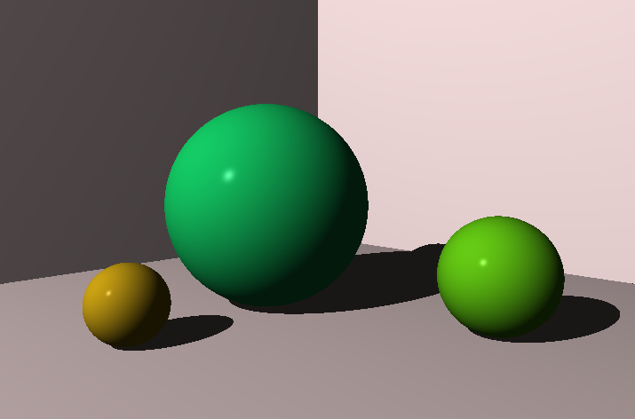
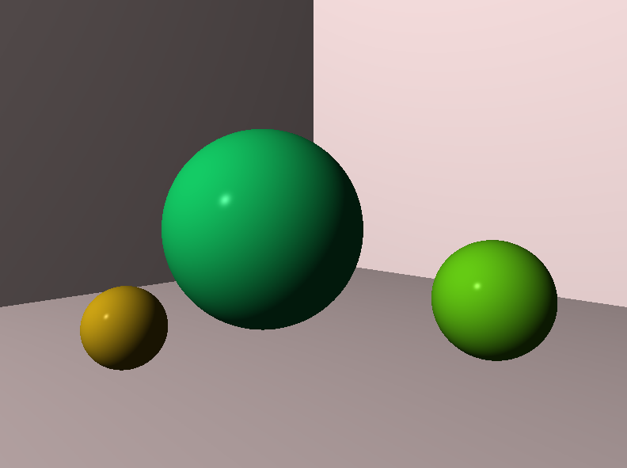
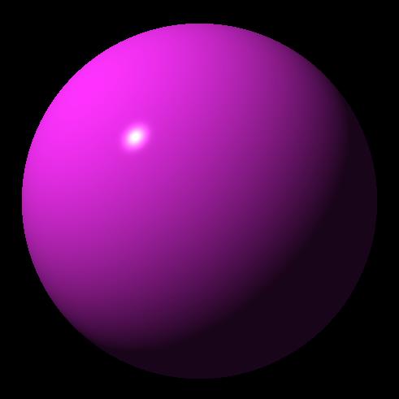
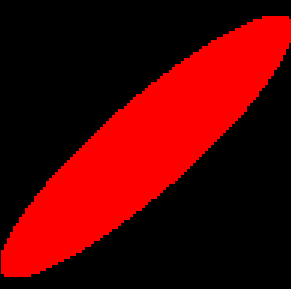
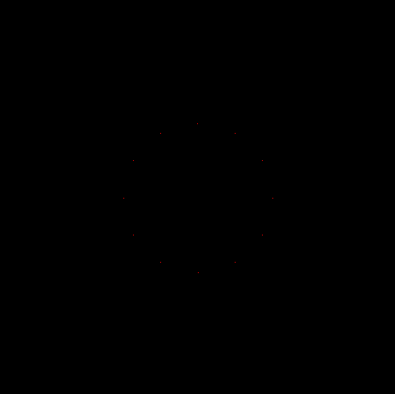
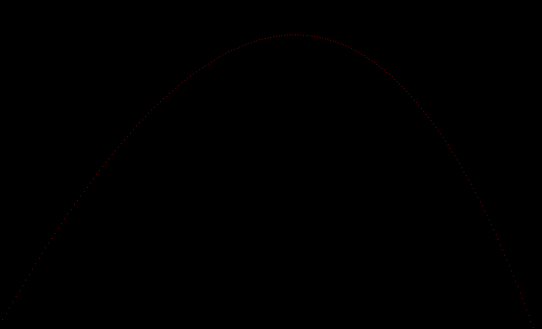

**The-Ray-Tracer-Challenge:**
As a means to practice programming and to learn C# along with .NET Core I will be attempting to implement a Ray Tracer described in the following book: https://pragprog.com/book/jbtracer/the-ray-tracer-challenge

**Chapter 8: Chapter implements Shadows into the scene. Focused on using the new EPSILON value (Changed from 0.0001 to 0.002) in combination with the surface normal to shade slightly out from the surface as to mitigate scene "acne"**

Result: The scene produced in Chapter 7 with shadows. 

**Chapter 7: Chapter implements a camera and view transformations matrix to achieve the creation of a scene with allows for simple object and camera movement**

Result: Using the example layout given in the book this scene shows how the camera and multiple objects can be placed in a scene and how the Phong lighting model is applied to all objects.

**Chapter 6: Chapter focuses on using the Phong Shading model to add specular, diffuse and ambient lighting**

Result: Using the Phong Shading model to draw the same Sphere as Chapter 5. A point light it used to light the scene and a material is applied to the sphere to give it colour properties instead of a single fixed colour.

**Chapter 5: Chapter focused implementing Ray-Sphere intersections which will be used as the basis of the ray tracer**

Result: Using Ray-Sphere intersections to draw a flat shaded Sphere which appears 2D, This is also the first time using ray tracing to draw. This Screenshot also shows using matrix transformations to stretch and scale the circle.

**Chapter 4: Chapter Focused implementing matrix transformations such as translation, rotation and scaling**

Result: Drawing a clock via manipulating pixel positions with matrix transformations.

**Chapter 2: Chapter Focused on creating a Canvas Object to enabling drawing.**

Result: Drawing an arch spanning the canvas.

The Program is currently not optimized, for even basic rendering.
Optimizations that can be made:

  Replace the Tuple Objects that is being used to represent colours with int primitivse and pack it with 8bits per colour channel. (Done)
  Use different file format so we do not have to convert all colours to a string.

  Update(15/12/2019): Replace basic string concatenation "string += string" with a string builder. Result: Exponential increase in writing the PPM file
  Combined with the new int to represent the pixels(which is optional as Tuple objects can still be used) it now takes significantly less time to create a file:
  Went from 10min to render and (900x500) image to 5 seconds for a (3840x2160), in both int and tuple mode.
